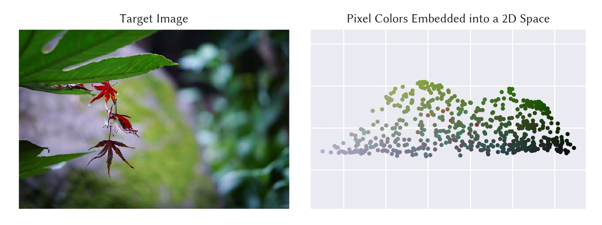

# classical-mds

Classical multi-dimensional scaling (MDS) for dimensionality reduction and low-dimensional embedding. This is also useful for visualizing the similarities of individual items in a 2-dimensional scattered plot.

## Header

```cpp
#include <mathtoolbox/classical-mds.hpp>
```

## Math

### Overview

Given a distance (or dissimilarity) matrix of $ n $ elements

$$
\mathbf{D} \in \mathbb{R}^{n \times n}
$$

and a target dimensionality $ m $, this technique calculates a set of $ m $-dimensional coordinates for them:

$$
\mathbf{X} = \begin{bmatrix} \mathbf{x}_1 & \cdots & \mathbf{x}_n \end{bmatrix} \in \mathbb{R}^{m \times n}.
$$

If the elements are originally defined in an $ m' $-dimensional space ($ m < m' $) and Euclidian distance is used for calculating the distance matrix, then this is considered dimensionality reduction (or low-dimensional embedding).

### Algorithm

First, calculate the kernel matrix:

$$
\mathbf{K} = - \frac{1}{2} \mathbf{H} \mathbf{D}^{(2)} \mathbf{H} \in \mathbb{R}^{n \times n},
$$

where $ \mathbf{H} $ is called the centering matrix and defined as

$$
\mathbf{H} = \mathbf{I} - \frac{1}{n} \mathbf{1}^T \mathbf{1} \in \mathbb{R}^{n \times n},
$$

and $ \mathbf{D}^{(2)} $ is the squared distance matrix.

Then, apply eigenvalue decomposition to $ \mathbf{K} $:

$$
\mathbf{K} = \mathbf{V} \mathbf{\Lambda} \mathbf{V}^T.
$$

Finally, pick up the $ m $-largest eigenvalues $ \mathbf{\Lambda}_m $ and corresponding eigenvectors $ \mathbf{V}_m $, and calculate $ \mathbf{X} $ by

$$
\mathbf{X} = \mathbf{V}_m \mathbf{\Lambda}_m^\frac{1}{2}.
$$

### Usage

This technique can be calculated by the following function:
```cpp
Eigen::MatrixXd ComputeClassicalMds(const Eigen::MatrixXd& D, const unsigned target_dim);
```
where `target_dim` is the target dimensionality for embedding.

## Example

The following is an example of applying the algorithm to the pixel RGB values of a target image and embedding them into a two-dimensional space.


## Useful Resources

- Josh Wills, Sameer Agarwal, David Kriegman, and Serge Belongie. 2009. Toward a perceptual space for gloss. ACM Trans. Graph. 28, 4, Article 103 (September 2009), 15 pages. DOI: <https://doi.org/10.1145/1559755.1559760>
