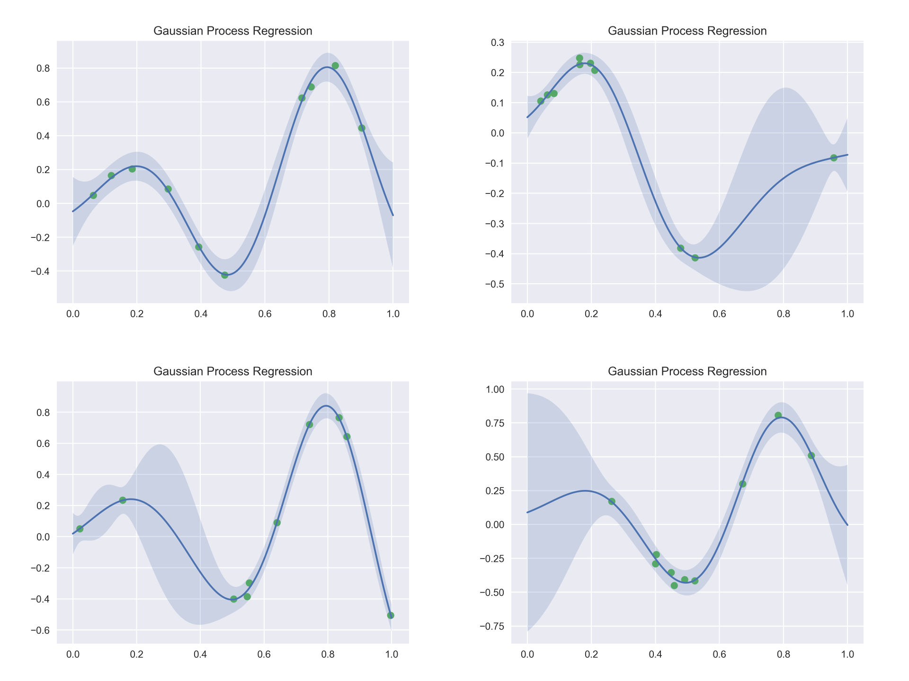

# gaussian-process-regression

Gaussian process regression (GPR) for scattered data interpolation and function approximation.



## Header

```
#include <mathtoolbox/gaussian-process-regression.hpp>
```

## Overview

### Input

The input consists of a set of $$ N $$ scattered data points:

$$
\{ (\mathbf{x}_i, y_i) \}_{i = 1, \ldots, N},
$$

where $$ \mathbf{x}_i \in \mathbb{R}^D $$ is the $$ i $$-th data point location and $$ y_i \in \mathbb{R} $$ is its value. This input data is denoted by

$$
\mathbf{X} = \begin{bmatrix} \mathbf{x}_{1} & \cdots & \mathbf{x}_{N} \end{bmatrix} \in \mathbb{R}^{D \times N}
$$

and

$$
\mathbf{y} = \begin{bmatrix} y_1 \\ \vdots \\ y_N \end{bmatrix} \in \mathbb{R}^{N}.
$$ 

### Output

Given the data some "Gaussian process" assumptions, GPR can calculate the most likely value $$ y $$ and its variance $$ \text{var}(y) $$ for an arbitrary location $$ \mathbf{x} $$. 

The variance roughly indicates how uncertain the estimation is. For example, when this value is large, the estimated value may not be very trustful (this often occurs in regions with less data points).

## Math

### Coveriance Function

The automatic relevance determination (ARD) squared exponential kernel is used.

$$
k(\mathbf{x}_p, \mathbf{x}_q) = \sigma_f^{2} \exp \left( - \frac{1}{2} (\mathbf{x}_p - \mathbf{x}_q)^{T} \text{diag}(\boldsymbol{\ell})^{-2} (\mathbf{x}_p - \mathbf{x}_q) \right) + \sigma_n^{2} \delta_{pq},
$$

where $$ \sigma_f^{2} $$, $$ \sigma_n^{2} $$, and $$ \boldsymbol{\ell} $$ are hyperparameters.

### Mean Function

A constant-value function is used.

$$
m(\mathbf{x}) = 0
$$

### Selecting Hyperparameters

Options:
- Set manually
- Determined by the maximum likelihood estimation

#### Maximum Likelihood Estimation

Let

$$
\boldsymbol{\theta} = \begin{bmatrix} \sigma_{f}^{2} \\ \sigma_{n}^{2} \\ \boldsymbol{\ell} \end{bmatrix} \in \mathbb{R}^{D + 2}.
$$

In this approach, the hyperparameters are determined by solving

$$
\boldsymbol{\theta}^\text{ML} = \mathop{\rm arg~max}\limits_{\boldsymbol{\theta}} p(\mathbf{y} \mid \mathbf{X}, \boldsymbol{\theta}).
$$

This maximization problem is solved by the L-BFGS method (a gradient-based local optimization algorithm) from the NLopt library <https://nlopt.readthedocs.io/>.

## Useful Resources

- Mark Ebden. 2015. Gaussian Processes: A Quick Introduction. [arXiv:1505.02965](https://arxiv.org/abs/1505.02965).
- Carl Edward Rasmussen and Christopher K. I. Williams. 2006. Gaussian Processes for Machine Learning. The MIT Press. Online version: <http://www.gaussianprocess.org/gpml/>

<script src="https://cdn.mathjax.org/mathjax/latest/MathJax.js?config=TeX-AMS-MML_HTMLorMML" type="text/javascript"></script>
