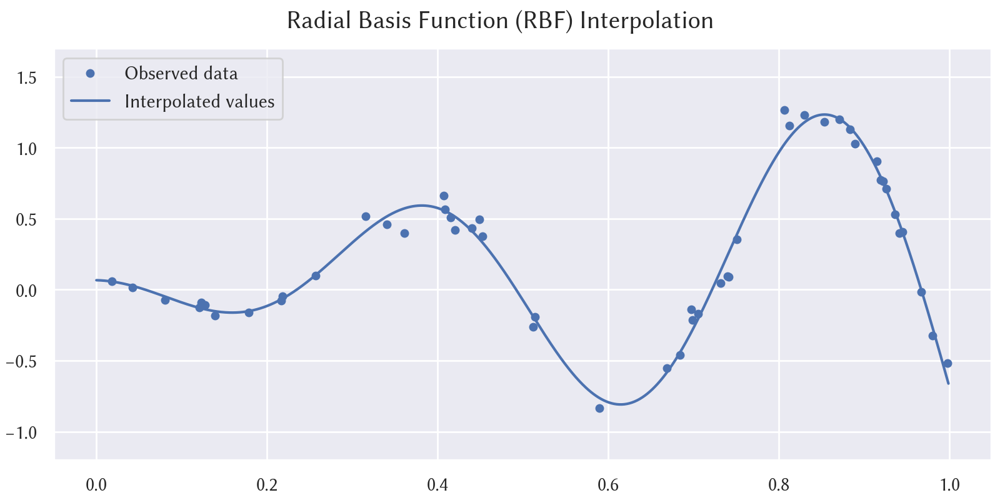
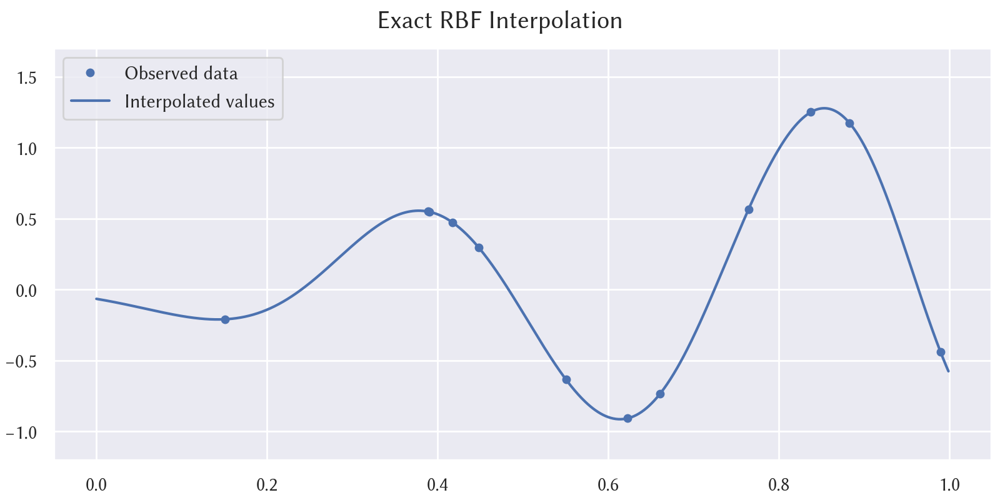
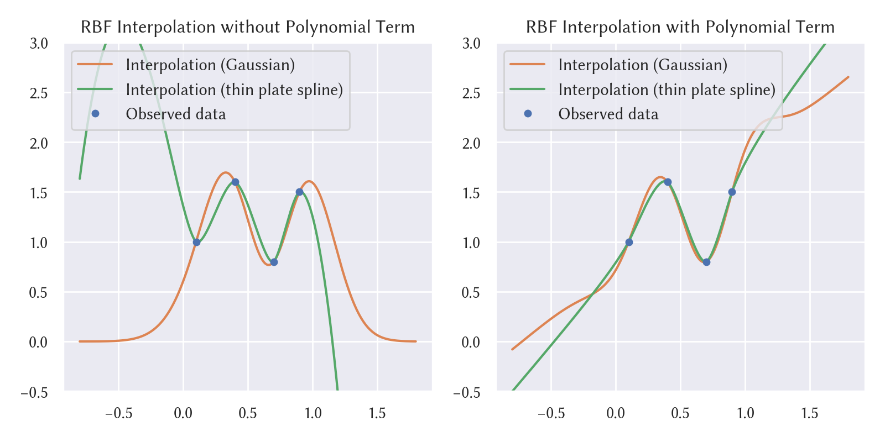

# rbf-interpolation

Radial basis function (RBF) network for scattered data interpolation and function approximation.



## Header

```cpp
#include <mathtoolbox/rbf-interpolation.hpp>
```

## Math

### Overview

Given input data:

$$
\{ (\mathbf{x}_i, y_i) \}_{i = 1, \ldots, n},
$$

this technique calculates an interpolated value $ y \in \mathbb{R} $ for a specified point $ \mathbf{x} \in \mathbb{R}^{m} $ by

$$
y = f(\mathbf{x}) = \sum_{i = 1}^{n} w_{i} \phi( \| \mathbf{x} - \mathbf{x}_{i} \|),
$$

where $ \phi : \mathbb{R}_{> 0} \rightarrow \mathbb{R} $ is a user-selected RBF, and

$$
\mathbf{w} = \begin{bmatrix} w_1 & \cdots & w_n \end{bmatrix}^T \in \mathbb{R}^{n}
$$

are the weights that are calculated in pre-computation.

### Pre-Computation

The weight values need to be calculated in pre-computation. Let

$$
\mathbf{\Phi} =
  \begin{bmatrix}
    \phi_{1, 1} & \cdots & \phi_{1, n} \\
    \vdots      & \ddots & \vdots      \\
    \phi_{n, 1} & \cdots & \phi_{n, n}
  \end{bmatrix} \in \mathbb{R}^{n \times n},
$$

where

$$
\phi_{i, j} = \phi(\| \mathbf{x}_i - \mathbf{x}_j \|).
$$

The following linear system is solved for $ \mathbf{w} $:

$$
\mathbf{\Phi} \mathbf{w} = \mathbf{y}.
$$

LU decomposition can be used for solving this problem.



This approach offers *exact* interpolation: the interpolated function passes through all the scattered data points exactly.

### Pre-Computation with Regularization

The original formulation above is not robust when the data points are dense and noisy. For such cases, it is effective to use a feature called *regularization* in pre-computation. In other words, this feature enables scattered data *approximation* rather than scattered data *(exact) interpolation*.


This feature is achieved by considering a regularization term in the calculation of the weight values. More specifically, the following minimization problem is solved:

$$
\min_{\mathbf{w}} \left\{ \| \mathbf{\Phi} \mathbf{w} - \mathbf{y} \|^2 + \lambda \| \mathbf{w} \|^2 \right\}.
$$

The derivative of this objective function with respect to $ \mathbf{w} $ is

$$
\begin{eqnarray*}
&& \frac{\partial}{\partial \mathbf{w}} \left\{ \| \mathbf{\Phi} \mathbf{w} - \mathbf{y} \|^2 + \lambda \| \mathbf{w} \|^2 \right\} \\
&=& \frac{\partial}{\partial \mathbf{w}} \| \mathbf{\Phi} \mathbf{w} - \mathbf{y} \|^2 + \lambda \frac{\partial}{\partial \mathbf{w}} \| \mathbf{w} \|^2 \\
&=& 2 \mathbf{\Phi}^T (\mathbf{\Phi} \mathbf{w} - \mathbf{y}) + 2 \lambda \mathbf{w} \\
&=& 2 \left\{ (\mathbf{\Phi}^T \mathbf{\Phi} + \lambda \mathbf{I}) \mathbf{w} - \mathbf{\Phi}^T \mathbf{y} \right\}.
\end{eqnarray*}
$$

Thus, the solution of the above minimization problem is obtained by solving the below linear system:

$$
(\mathbf{\Phi}^T \mathbf{\Phi} + \lambda \mathbf{I}) \mathbf{w} = \mathbf{\Phi}^T \mathbf{y}.
$$

### Adding Polynomial Term (and Polyharmonic Spline)

The above techniques can be extended by adding a polynomial term; that is,

$$
y = f(\mathbf{x}) = \sum_{i = 1}^{n} w_{i} \phi( \| \mathbf{x} - \mathbf{x}_{i} \|) + v_{0} + v_{1} x_{1} + \cdots + v_{m} x_{m}.
$$

This extension is also referred to as *polyharmonic spline* when it is used with *polyharmonic RBF kernels* (e.g., the linear kernel, the thin plate spline kernel, and the cubic kernel).

This extension offers several nice properties; for example, this makes the extrapolation behavior much more reasonable as shown below. See [Anjyo et al. 2014] for details.



This extension is recommended to always use and enabled by default.

## Usage

First, instantiate the class `RbfInterpolator`. In its constructor, an arbitrary RBF kernel (in the form of `std::function<double(double)>`) can be specified.

The followings are pre-implemented as function objects and can be easily specified:

- `GaussianRbfKernel`: $\phi(x) = \exp(- \epsilon x^{2})$
- `LinearRbfKernel`: $\phi(x) = x$
- `ThinPlateSplineRbfKernel`: $\phi(x) = x^{2} \log(x)$
- `CubicRbfKernel`: $\phi(x) = x^{3}$

If no kernel is passed to the constructor, `ThinPlateSplineRbfKernel` is chosen by default.

Then, set the target scattered data by the method:
```cpp
void SetData(const Eigen::MatrixXd& X, const Eigen::VectorXd& y);
```
where

$$
\mathbf{X} = \begin{bmatrix} \mathbf{x}_{1} & \cdots & \mathbf{x}_{n} \end{bmatrix} \in \mathbb{R}^{m \times n}
$$

represents the data points and

$$
\mathbf{y} = \begin{bmatrix} y_1 & \cdots & y_n \end{bmatrix}^T \in \mathbb{R}^{m}
$$

represents their values.

Next, calculate the weight values by the method:
```cpp
void ComputeWeights(const bool   use_regularization = false,
                    const double lambda             = 0.001);
```
When `use_regularization` is set `true`, the weights are calculated in the manner of scattered data *approximation*, rather than scattered data interpolation. When the data is noisy, approximation is usually a better choice.

Once the above procedures are performed, the instance is ready to calculate interpolated values. This is performed by the method
```cpp
double CalcValue(const Eigen::VectorXd& x) const;
```

## Time Complexity

The pre-computation needs to solve a linear system, which takes more than $O(n^{2})$. An interpolated value calculation takes $O(n)$. See [Carr et al. 2001] for details.

## Useful Resources

- Ken Anjyo, J. P. Lewis, and Frédéric Pighin. 2014. Scattered data interpolation for computer graphics. In ACM SIGGRAPH 2014 Courses (SIGGRAPH '14). Article 27, 69 pages. DOI: <https://doi.org/10.1145/2614028.2615425>
- J. C. Carr, R. K. Beatson, J. B. Cherrie, T. J. Mitchell, W. R. Fright, B. C. McCallum, and T. R. Evans. 2001. Reconstruction and representation of 3D objects with radial basis functions. In Proc. SIGGRAPH '01. 67–76. DOI: <https://doi.org/10.1145/383259.383266>
- Polyharmonic spline. <https://en.wikipedia.org/wiki/Polyharmonic_spline>
