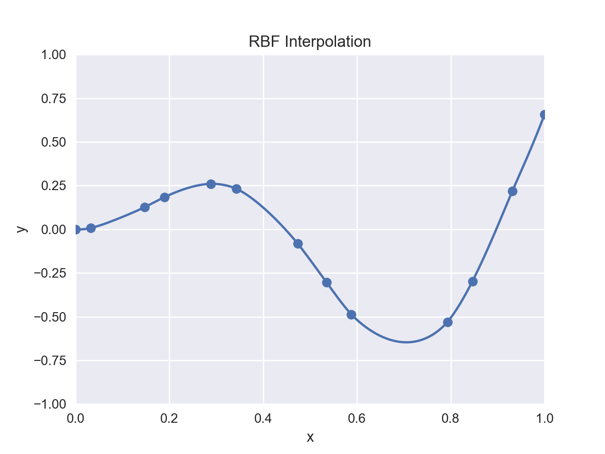
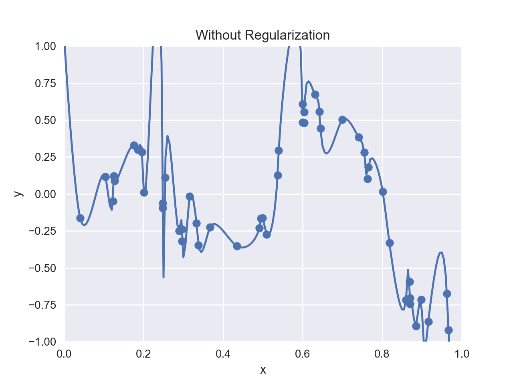
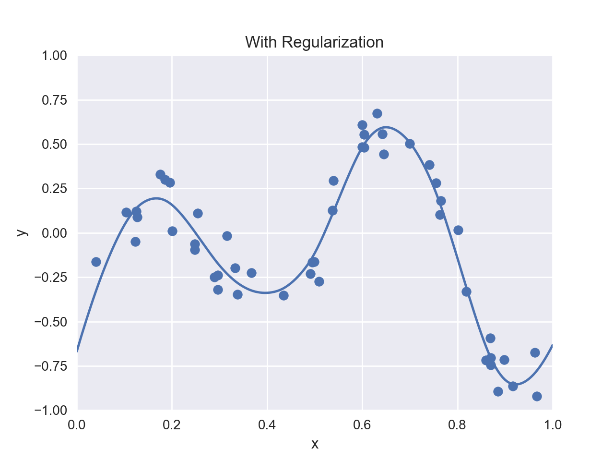

# rbf-interpolation

Radial basis function (RBF) network for scattered data interpolation and function approximation.

## Header

```cpp
#include <mathtoolbox/rbf-interpolation.hpp>
```

## Math

### Overview

Given input data:

$$
\{ (\mathbf{x}_i, y_i) \}_{i = 1, \ldots, n},
$$

this technique calculates an interpolated value $ y $ for a specified point $ \mathbf{x} $ by

$$
y = f(\mathbf{x}) = \sum_{i = 1}^{n} w_{i} \phi( \| \mathbf{x} - \mathbf{x}_{i} \|),
$$

where $ \phi(\cdot) $ is a user-selected RBF and $ w_1, \cdots, w_n $ are weights that are calculated in pre-computation.



### Pre-Computation

The weight values need to be calculated in pre-computation. Let

$$
\mathbf{w} = \begin{bmatrix} w_1 & \cdots & w_n \end{bmatrix}^T
$$

and

$$
\mathbf{\Phi} =
  \begin{bmatrix}
    \phi_{1, 1} & \cdots & \phi_{1, n} \\
    \vdots      & \ddots & \vdots      \\
    \phi_{n, 1} & \cdots & \phi_{n, n}
  \end{bmatrix},
$$

where

$$
\phi_{i, j} = \phi(\| \mathbf{x}_i - \mathbf{x}_j \|).
$$

The following linear system is solved for $ \mathbf{w} $:

$$
\mathbf{\Phi} \mathbf{w} = \mathbf{y}.
$$

LU decomposition can be used for solving this problem.

### Pre-Computation with Regularization

The original formulation above is not robust (i.e., overfitting can occur) when the data points are dense and noisy.



For such scenarios, it is possible to add a *regularization* term into pre-computation. That is, the following minimization problem is solved:

$$
\min_{\mathbf{w}} \left\{ \| \mathbf{\Phi} \mathbf{w} - \mathbf{y} \|^2 + \lambda \| \mathbf{w} \|^2 \right\}.
$$

The derivative of this objective function with respect to $ \mathbf{w} $ is

$$
\begin{eqnarray*}
&& \frac{\partial}{\partial \mathbf{w}} \left\{ \| \mathbf{\Phi} \mathbf{w} - \mathbf{y} \|^2 + \lambda \| \mathbf{w} \|^2 \right\} \\
&=& \frac{\partial}{\partial \mathbf{w}} \| \mathbf{\Phi} \mathbf{w} - \mathbf{y} \|^2 + \lambda \frac{\partial}{\partial \mathbf{w}} \| \mathbf{w} \|^2 \\
&=& 2 \mathbf{\Phi}^T (\mathbf{\Phi} \mathbf{w} - \mathbf{y}) + 2 \lambda \mathbf{w} \\
&=& 2 \left\{ (\mathbf{\Phi}^T \mathbf{\Phi} + \lambda \mathbf{I}) \mathbf{w} - \mathbf{\Phi}^T \mathbf{y} \right\}.
\end{eqnarray*}
$$

Thus, the solution of the above minimization problem can be obtained by solving the below linear system:

$$
(\mathbf{\Phi}^T \mathbf{\Phi} + \lambda \mathbf{I}) \mathbf{w} = \mathbf{\Phi}^T \mathbf{y}.
$$



## Usage

First, instantiate the class `RbfInterpolation`. Via the constructor, an RBF can be specified from the following options:

- `Gaussian`
- `ThinPlateSpline`
- `InverseQuadratic`
- `Linear`

By default, `ThinPlateSpline` (i.e., $ \phi(x) = x^2 \log(x) $) is chosen.

Then, set the target scattered data by the method:
```cpp
void SetData(const Eigen::MatrixXd& X, const Eigen::VectorXd& y);
```
where

$$
\mathbf{X} = \begin{bmatrix} \mathbf{x}_{1} & \cdots & \mathbf{x}_{n} \end{bmatrix} \in \mathbb{R}^{m \times n}
$$

represents the data points and

$$
\mathbf{y} = \begin{bmatrix} y_1 & \cdots & y_n \end{bmatrix}^T
$$

represents their values.

Next, calculate the weight values by the method:
```cpp
void ComputeWeights(bool use_regularization = false,
                    double lambda = 0.001);
```
When `use_regularization` is set `true`, the weights are calculated in the manner of scattered data approximation, rather than scattered data interpolation. When the data is noisy, approximation is usually a better choice.

Once the above procedures are performed, the instance is ready to calculate interpolated values. This is performed by the method
```cpp
double GetValue(const Eigen::VectorXd& x) const;
```

## Useful Resources

- Ken Anjyo, J. P. Lewis, and Frédéric Pighin. 2014. Scattered data interpolation for computer graphics. In ACM SIGGRAPH 2014 Courses (SIGGRAPH '14). ACM, New York, NY, USA, Article 27, 69 pages. DOI: <https://doi.org/10.1145/2614028.2615425>
